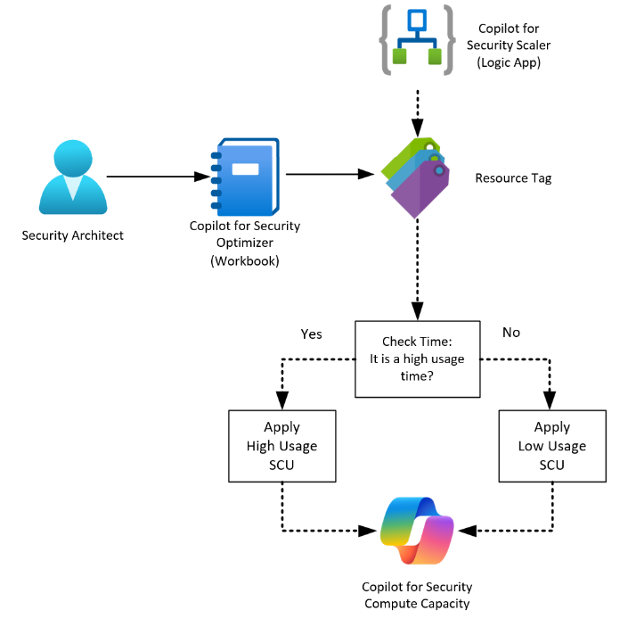

# CopilotforSecurity-Scaler
Author: Lachlan Watson

This solution will allow you to view and control the Copilot for Security Compute Capacity. 
The solution is created using 2 components:
- Sentinel Workbook - Copilot for Security Optimizer
- Playbook (Logic App) - Copilot for Security Scaler

The Copilot for Security Optimizer Sentinel solution has 3 distinct features.  It is used to view and deploy a schedule to a Copilot for Security Compute Capacity by applying and interpreting Azure Resource Tags.  In the event of a SOC operating in a more limited capacity than 24x7 such as 8x5 this can mean significant cost savings by allowing the playbook to scale the compute capacity according to the schedule that has been applied. 

[Learn more about Copilot for Security](https://learn.microsoft.com/en-us/copilot/security/microsoft-security-copilot) 
[Learn more about Playbooks (Logic Apps)](https://learn.microsoft.com/en-us/azure/logic-apps/logic-apps-overview) 
[Learn more about Workbooks](https://learn.microsoft.com/en-us/azure/azure-monitor/visualize/workbooks-overview) 

## Prerequisites
Ideally you already have a Copilot for Security Compute Capacity deployed, if not you should considering deploying a compute capacity in the near future, as all capabilities of this solution rely on having a compute capacity already deployed.

Least-privilege resource deployment requires:
- Workbook - Monitoring Contributor
- Playbook - Logic App Contributor

Post-config requirements:
Subscription Owner is required to create and apply a least-privilege custom role for the Playbook. You may choose to assign the Contributor role if you do not want to use a custom role. 

## Deployment
**Deploy Solution**

## Post-deployment
1. (Optional) Deploy the Copilot for Security Capacity Creator role to each subscription where Copilot for Security Compute Capacities are present for a least-privilege approach 

2. Assign the Copilot for Security Capacity Creator custom role, or Contributor built-in role to the Playbook's managed identity - https://docs.microsoft.com/azure/logic-apps/create-managed-service-identity?tabs=consumption#assign-managed-identity-role-based-access-in-the-azure-portal

3. Open the playbook in the Logic App Designer and ensure connections are displaying correctly  

## Screenshots
**Workbook - View No Schedule** 

  
**Workbook - Apply/Modify Schedule** 

  
**Playbook** 

